# PRV

PRV is a Git‑native "memory layer" for AI‑assisted development.

It traces any line of code back to its origin — the AI session that created it, the reasoning behind it, and the alternatives that were rejected.

**Tagline:** Git tells you what changed. PRV tells you why, what else was considered, and how understanding evolved.

---

## Current Status

**Phase 1 Complete (2025-12-29)**
- ✅ Core commit→session linking working
- ✅ 100% accuracy on validated commits
- ✅ `prv link` and `prv query` commands

**Next:** Phase 2 (LSP hover, heat map, enhanced summaries)

---

## How It Works

```mermaid
%%{init: {'theme': 'base', 'themeVariables': { 'primaryColor': '#6366f1', 'primaryTextColor': '#fff', 'primaryBorderColor': '#4f46e5', 'lineColor': '#a5b4fc', 'secondaryColor': '#1e1b4b', 'tertiaryColor': '#312e81', 'background': '#0f0d1a', 'mainBkg': '#1e1b4b', 'nodeBorder': '#6366f1', 'clusterBkg': '#1e1b4b', 'clusterBorder': '#4f46e5', 'titleColor': '#e0e7ff'}}}%%

flowchart LR
    subgraph INPUT[" "]
        direction TB
        CC["☁️ Claude Code"]
        CU["✨ Cursor"]
        CO["🔮 Codex"]
        GIT["📦 Git Commits"]
    end

    subgraph CAPTURE["CASS"]
        direction TB
        C1["🔍 Discover"]
        C2["📝 Normalize"]
        C3[("💾 SQLite")]
        C1 --> C2 --> C3
    end

    subgraph ENGINE["PRV Engine"]
        direction TB

        subgraph MATCH[" "]
            direction LR
            M0["⏱️ Gates"]
            M1["📁 Files"]
            M2["#️⃣ Hashes"]
            M0 --> M1 --> M2
        end

        LINK["🔗 Link"]
        MATCH --> LINK
    end

    subgraph OUTPUT[" "]
        direction TB
        O1["💻 CLI"]
        O2["🖱️ Hover"]
        O3["🗺️ Heat Map"]
    end

    CC & CU & CO --> CAPTURE
    GIT --> ENGINE
    CAPTURE --> ENGINE
    ENGINE --> OUTPUT

    style INPUT fill:#0f172a,stroke:#334155,color:#e2e8f0
    style CAPTURE fill:#1e1b4b,stroke:#6366f1,color:#e0e7ff
    style ENGINE fill:#312e81,stroke:#8b5cf6,color:#f5f3ff
    style MATCH fill:#3730a3,stroke:#a78bfa,color:#f5f3ff
    style OUTPUT fill:#4c1d95,stroke:#a855f7,color:#faf5ff
```



PRV reads session data from [CASS](https://github.com/Dicklesworthstone/coding_agent_session_search) (Coding Agent Session Search), which automatically captures sessions from Claude Code, Cursor, Codex, and other AI tools. PRV then:

1. **Links commits to sessions** using a 3-step matching pipeline
2. **Stores links** in `.prv/links/` for fast lookup
3. **Surfaces context** via CLI (now) and LSP hover (Phase 2)

The end result: Git still tells you *what* changed; PRV makes it easy to see *why*.

---

## The promise (product principles)

- **Git-native:** no new backend, no hosted service requirement.
- **Local-first & private by default:** everything stays on your machine unless you explicitly push it.
- **Immutable artifacts:** Drafts and Links are append-only; never silently edited.
- **Non-invasive:** PRV should not change how you commit code; it should not block normal Git workflows.
- **Deterministic:** given the same inputs, linking should produce the same results.

---

## Quick Start

```bash
# Build PRV
cargo build --release

# Link a commit to its originating session
prv link --commit HEAD

# Query the link
prv query HEAD
```

**Requires:** [CASS](https://github.com/Dicklesworthstone/coding_agent_session_search) installed and running

---

## The Mental Model

### Session (from CASS)

PRV reads sessions from CASS's SQLite database. Each session contains:
- **Conversation:** timestamped record of AI tool interaction
- **Messages:** user prompts and AI responses with code blocks
- **Workspace:** maps to git repository path

Sessions are managed by CASS; PRV only reads them.

### Link

A Link is: "this commit was produced by this session."

```json
{
  "commit_sha": "753d0668c521ab449584fbd3611b41fa328082ad",
  "session_id": 771,
  "confidence": 1.0,
  "match_step": 1,
  "created_at": "2025-12-29T01:12:03Z"
}
```

Links are stored in `.prv/links/<prefix>/<sha>.json`.

### Index

The Index maps commit SHAs to session IDs for fast lookup.

```json
{
  "version": 1,
  "commits": {
    "753d066": 771,
    "2456bbd": 771
  }
}
```

### `prv-memory` branch (Phase 3)

For sharing enhanced summaries across team members via an orphan branch.

---

## Where PRV Stores Data

PRV creates a `.prv/` directory in your repo:

```
.prv/
├── links/            # Link JSON files (commit → session)
│   ├── 75/           # Prefix directories for scalability
│   │   └── 753d0668...json
│   └── 24/
│       └── 2456bbd6...json
└── index.json        # Fast lookup index
```

PRV reads from CASS (doesn't modify it):
```
~/Library/Application Support/com.coding-agent-search.coding-agent-search/agent_search.db
```

---

## Matching Algorithm

PRV uses a 3-step pipeline to match commits to sessions:

### Step 0: Single Candidate
If only one session exists in the time window for this workspace, it wins automatically.

### Step 1: File Path Overlap
Extract file paths mentioned in session messages (regex on message content). Compare to files changed in the commit. Best overlap wins.

### Step 2: Line Hash Overlap
Extract code blocks from session messages. Normalize and hash each line. Compare to commit diff lines. >50% overlap required for a match.

Each step returns a confidence score (0.0-1.0) and the match step used.

---

## CLI Commands

### `prv link --commit <ref>`

Link a commit to its originating session:

```bash
$ prv link --commit HEAD
Linked 753d066 → session 771 (100% confidence, step 1)
```

### `prv query <ref>`

Query the link for a commit:

```bash
$ prv query HEAD
Commit:     753d066
Session:    771
Confidence: 100%
Match step: 1
Linked at:  2025-12-29 01:12:03 UTC
```

### `prv query <ref> --json`

JSON output for scripting:

```json
{
  "commit_sha": "753d0668c521ab449584fbd3611b41fa328082ad",
  "session_id": 771,
  "confidence": 1.0,
  "match_step": 1,
  "created_at": "2025-12-29T01:12:03.195925Z"
}
```

### `prv debug cass` (Phase 0)

Verify CASS connection:

```bash
$ prv debug cass
CASS database found
Sessions: 545
Workspaces: 12
```

---

## Roadmap

### Phase 1 ✅ (Complete)
- Core commit→session linking
- CLI: `prv link`, `prv query`
- 100% accuracy on validated commits

### Phase 2 (In Progress)
- LSP hover with session context
- Provenance heat map
- Enhanced summaries with "roads not taken"

### Phase 3 (Planned)
- `prv-memory` branch for team sharing
- `prv blame`, `prv install` commands
- Git hooks integration

---

## What PRV Is Not

- Not a replacement for Git history
- Not a server product (local-first, Git transport)
- Not an AI code generator (it traces, not creates)
- Not a guarantee of perfect attribution (heuristic matching)

---

## Glossary

| Term | Meaning |
|---|---|
| Session | CASS record of an AI tool conversation |
| Link | Mapping from commit SHA → session ID |
| Index | Fast lookup from commit → session |
| CASS | Coding Agent Session Search (session capture) |
| prv-memory | Orphan branch for sharing (Phase 3) |

---

## Development

```bash
# Build
cargo build

# Test
cargo test

# Run
cargo run -- link --commit HEAD
cargo run -- query HEAD
```

See `PLAN/` for architecture, requirements, and phase details.

